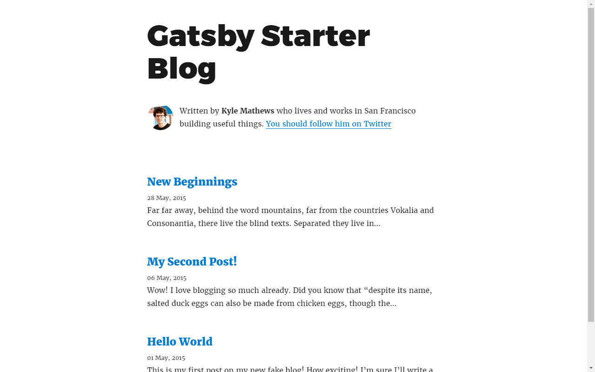
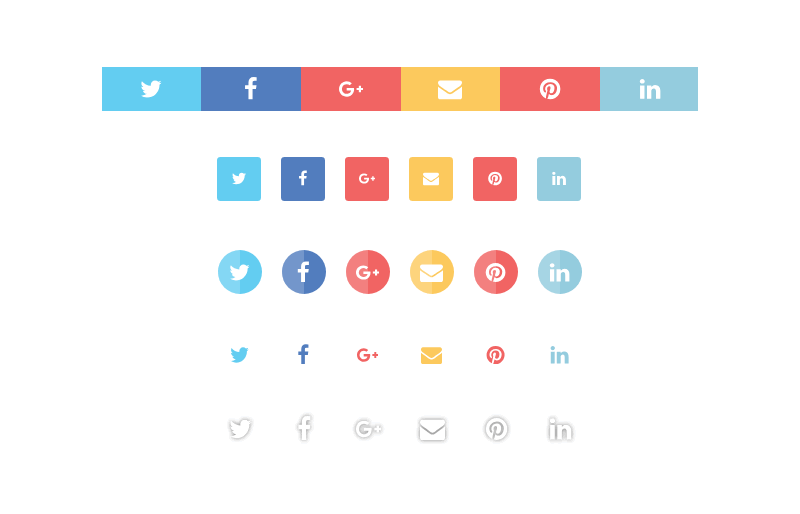
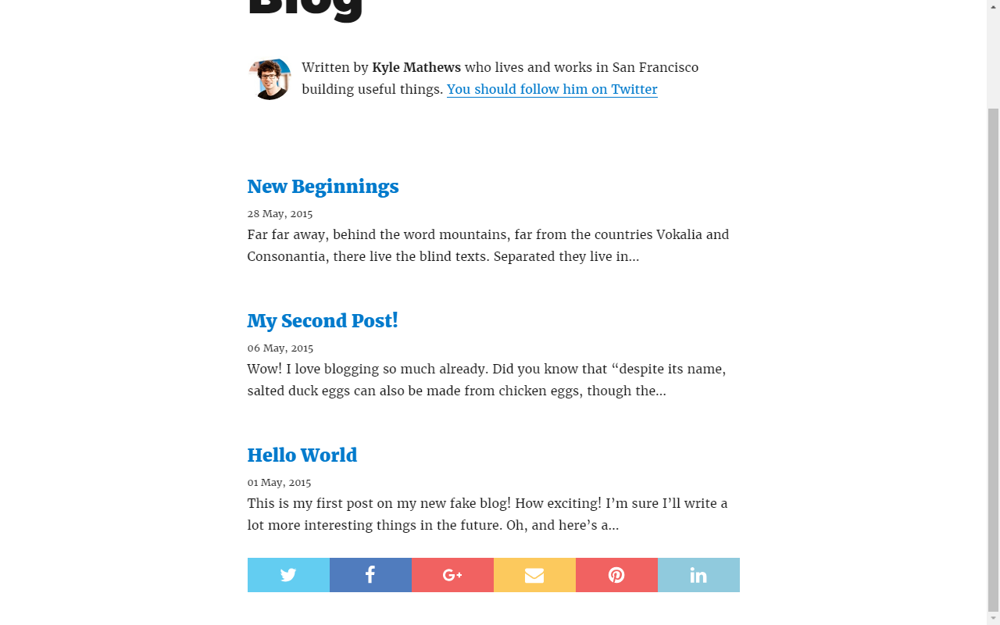
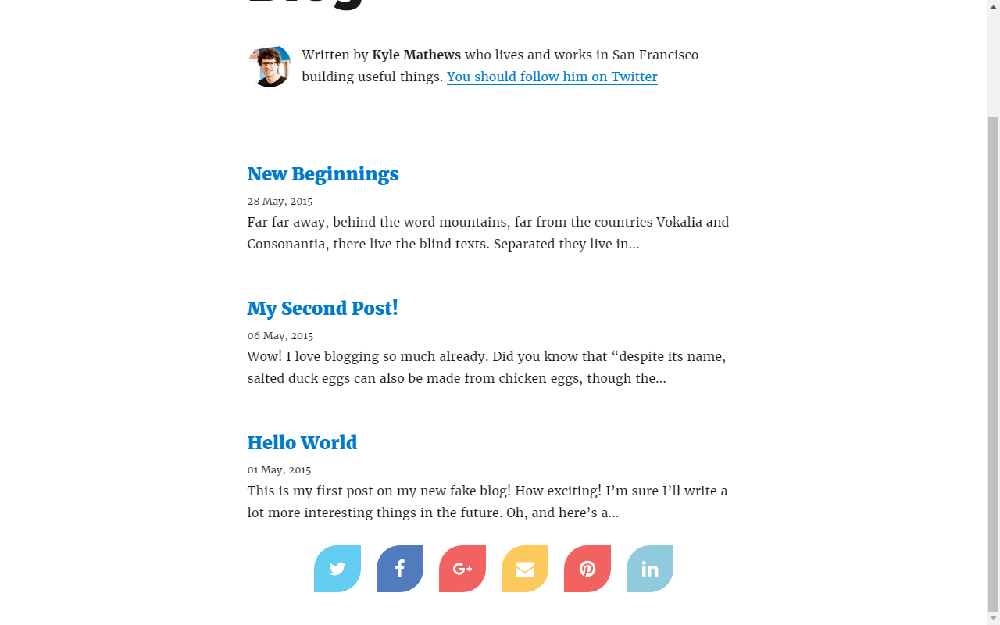

Social sharing buttons are the essential functionality for any blog. So, in this series of posts we will implement a social sharing block on a blog built with GatsbyJS.

I assume, you already know what [GatsbyJS](https://www.gatsbyjs.org/) is. In other case you would not be interested in the subject, would you?

Can we begin? OK.

## GatsbyJS installation

Let's start it off with the [gatsby-starter-blog](https://github.com/gatsbyjs/gatsby-starter-blog) installation.

```
gatsby new gatsby-with-social-buttons  https://github.com/gatsbyjs/gatsby-starter-blog.git
```

then move into newly created folder `gatsby-with-social-button/`.

```
cd gatsby-with-social-buttons
```

## react-custom-share

To get things done faster we'll employ the [react-custom-share](https://www.npmjs.com/package/react-custom-share) package. There are other packages more or less like this one, but the choice is not at all accidental. It's 'my' package, I mean I did it and I believe it's the best tool to achive the goal.

I will be using `yarn`, but of course you can use `npm` and its corresponding commands.

```
yarn add react-custom-share
```

### CSS-in-JS

In this part of the series (the first one) we will use built-in styled buttons from the package so besides `react-custom-share` itself we also need `emotion`, a CSS-in-JS library.

If you know nothing about [emotion](https://github.com/emotion-js/emotion) yet, no worries, I will guide you step by step and in the next part of the series I will show you how to build your own custom styled buttons without using `emotion`. You will be able to use any other CSS-in-JS library or plain CSS if you prefer.

```
yarn add emotion
```

### Icons

Ahhh, one more thing. We need icons. In this tutorial we will use the [Free Font Awesome](https://fontawesome.com/?from=io) icons provided by [react-icons](https://github.com/react-icons/react-icons) as React components.

```
yarn add react-icons
```

In your blog you can use any other icons. One requirement, if you want to use `react-custom-share` built-in styled buttons, the icons have to render to **svg** elements. If you will build your own custom styled button there is no any requirement for what you will set as a button inner content, more about that in the next parts of the series.

## Run GatsbyJS

Now we are ready to start our blog in development mode. Run ...

```
gatsby develop
```

and open the `http://localhost:8000/` address in your web browser.

You should see a nicely looking home page of the GatsbyJS default blog starter with [Kyle Mathews](https://twitter.com/kylemathews), the creator of GatsbyJS, smiling at you.



Of course there is not yet the social sharing buttons.

## Add social sharing block to the Home page

### Import modules

Go to your text editor or IDE and open the `src/pages/index.js` file and add icons `import` statements.

```javascript
// import icons
import FaTwitter from "react-icons/lib/fa/twitter";
import FaFacebook from "react-icons/lib/fa/facebook";
import FaGooglePlus from "react-icons/lib/fa/google-plus";
import FaEnvelope from "react-icons/lib/fa/envelope";
import FaPinterest from "react-icons/lib/fa/pinterest";
import FaLinkedin from "react-icons/lib/fa/linkedin";
```

and `react-custom-share` components;

```javascript
// import react-custom-share components
import { ShareButtonRectangle, ShareBlockStandard } from "react-custom-share";
```

There are five built-in styled button components in the `react-custom-search`, we'll use `ShareButtonRectangle`.

The other four are:

* ShareButtonRoundSquare
* ShareButtonCircle
* ShareButtonIconOnly
* ShareButtonOutline



### Prepare props for the block component

Now, inside the `render()` method of the `BlogIndex` class add an object with properties as below. The `url`, `button` and `buttons` are required props, the last two `text` and `longtext` are optional.

```javascript
const shareBlockProps = {
  url: "https://localhost:8000/",
  button: ShareButtonRectangle,
  buttons: [
    { network: "Twitter", icon: FaTwitter },
    { network: "Facebook", icon: FaFacebook },
    { network: "GooglePlus", icon: FaGooglePlus },
    { network: "Email", icon: FaEnvelope },
    { network: "Pinterest", icon: FaPinterest, media: "https://localhost:8000/image-to-share.jpg" },
    { network: "Linkedin", icon: FaLinkedin }
  ],
  text: `Give it a try - mywebsite.com `,
  longtext: `Take a look at this super website I have just found.`
};
```

Finally add `ShareBlockStandard` at the end of the `render`'s method `return` statement, just before the closing `</div>` tag. Do not forget to pass on the `props` to the component.

```
<ShareBlockStandard {...shareBlockProps} />
```

## Voila!

Scroll down the page and you should see the social sharing block on its place. Pretty nice huh? :thumbsup: :clap:



If you do not see the buttons, take a look at the code below, your `src/pages/index.js` file should look like this.

```javascript
import React from "react";
import Link from "gatsby-link";
import get from "lodash/get";
import Helmet from "react-helmet";

import Bio from "../components/Bio";
import { rhythm } from "../utils/typography";

import FaTwitter from "react-icons/lib/fa/twitter";
import FaFacebook from "react-icons/lib/fa/facebook";
import FaGooglePlus from "react-icons/lib/fa/google-plus";
import FaEnvelope from "react-icons/lib/fa/envelope";
import FaPinterest from "react-icons/lib/fa/pinterest";
import FaLinkedin from "react-icons/lib/fa/linkedin";

import { ShareButtonRectangle, ShareBlockStandard } from "react-custom-share";

class BlogIndex extends React.Component {
  render() {
    const siteTitle = get(this, "props.data.site.siteMetadata.title");
    const posts = get(this, "props.data.allMarkdownRemark.edges");

    const shareBlockProps = {
      url: "https://mywebsite.com/page-to-share/",
      button: ShareButtonRectangle,
      buttons: [
        { network: "Twitter", icon: FaTwitter },
        { network: "Facebook", icon: FaFacebook },
        { network: "GooglePlus", icon: FaGooglePlus },
        { network: "Email", icon: FaEnvelope },
        {
          network: "Pinterest",
          icon: FaPinterest,
          media: "https://mywebsite.com/image-to-share.jpg"
        },
        { network: "Linkedin", icon: FaLinkedin }
      ],
      text: `Give it a try - mywebsite.com `,
      longtext: `Take a look at this super website I have just found.`,
      buttonCustomClassName: customStyles
    };

    return (
      <div>
        <Helmet title={siteTitle} />
        <Bio />
        {posts.map(({ node }) => {
          const title = get(node, "frontmatter.title") || node.fields.slug;
          return (
            <div key={node.fields.slug}>
              <h3 style={{ marginBottom: rhythm(1 / 4) }}>
                <Link style={{ boxShadow: "none" }} to={node.fields.slug}>
                  {title}
                </Link>
              </h3>
              <small>{node.frontmatter.date}</small>
              <p dangerouslySetInnerHTML={{ __html: node.excerpt }} />
            </div>
          );
        })}
        <ShareBlockStandard {...shareBlockProps} />
      </div>
    );
  }
}

export default BlogIndex;

export const pageQuery = graphql`
  query IndexQuery {
    site {
      siteMetadata {
        title
      }
    }
    allMarkdownRemark(sort: { fields: [frontmatter___date], order: DESC }) {
      edges {
        node {
          excerpt
          fields {
            slug
          }
          frontmatter {
            date(formatString: "DD MMMM, YYYY")
            title
          }
        }
      }
    }
  }
`;
```

## Customize it

That's only a first step. The title of this blog post is **How to add custom social share buttons to GatsbyJS blog**, but these ones you have just added are using a `react-custom-share` built-in button theme.

But you have not to stay with a built-in theme. You can override any of the built-in theme's style and get the look you want.

Let's do it.

To do the job I will us `emotion`. Do you remember, we installed the library at the [CSS-in-JS](#css-in-js) section. So now, we only have to add a proper `import` statement. We do not need to import the whole library, only its `css` method.

```javascript
// import emotion
import { css } from "emotion";
```

Now in the `render()` method, above the `shareBlockProps` variable's declaration add the code like below.

```javascript
const customStyles = css`
  border-radius: 50% 0 50% 0;
  margin: 0 10px;
  flex-basis: 60px;
  height: 60px;
  flex-grow: 0;
`;
```

The `emotion`'s `css` method returns a unique class name, for example a string like this 'css-1b35k40' one.

Now we have to 'inform' `react-custom-share` script that we want to apply this new CSS declarations to the share buttons. They will be applied as the last ones so they will override the built-in theme's default declarations. More about that in the following parts of the series.

To do that add new property `buttonCustomClassName` to the `shareBlockProps` object.

```javascript
const shareBlockProps = {
  /* ... */

  /* other properties stay the same */
  buttonCustomClassName: customStyles
};
```

Take a look at your customized social share buttons.



Sassy, don't you think? :smile:

Congratulations! You have just met the first target of the series. In the following parts of it you will learn:

* How to add the sharing block to every post page of your blog, not only to the Home.
* How to create a custom share button from scratch.
* How to do it without the `emotion` library. Maybe you are using `styled-components` in your projects or just prefer to use plain CSS.
* How the `react-custom-share` works, what exactly the script does and how.

You will learn a lot, so stay tuned. Follow me on [twitter](https://twitter.com/@greglobinski) or [medium](https://medium.com/@greglobinski) to be informed about following parts of the series.
